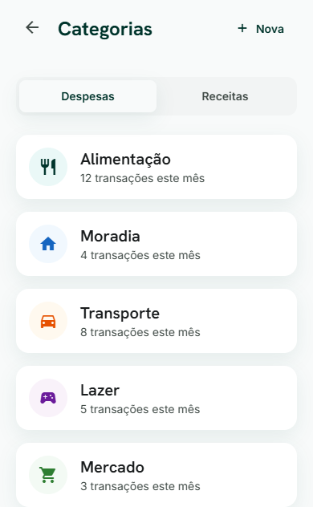
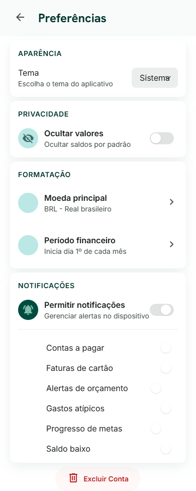

# Tonti

[English](README.md)

[](https://github.com/victor-dias-dev/TONTI/actions/workflows/ci.yml)
[](LICENSE)

Finanças pessoais no Brasil, para uma pessoa: dinheiro exato, ciclo de faturamento que não é obrigatoriamente o mês civil, e registros que pertencem a um único usuário.

Valores são `DECIMAL(19, 4)`. Timestamps são UTC. A API não devolve contas, transações nem orçamentos de outro usuário. O assistente é uma leitura calculada do mês financeiro aberto, não um modelo de linguagem.





## O que o app cobre

- Autenticação, perfil e preferências (tema, saldos ocultos, moeda, dia de início do ciclo)
- Contas, categorias, transações e parcelas
- Cartões de crédito, orçamentos e assinaturas
- Dashboard
- Insights do assistente sobre o mês financeiro aberto

## Requisitos

- Node.js 22+
- pnpm 9+
- Docker e Docker Compose

## Como subir

```bash
pnpm install
docker compose up -d
cp apps/api/.env.example apps/api/.env
cp apps/mobile/.env.example apps/mobile/.env
pnpm db:generate
pnpm db:migrate:deploy
pnpm db:seed
pnpm dev
```

O usuário de desenvolvimento é `demo@tonti.app` / `Demo1234!`.

`pnpm dev` sobe a API NestJS e o Metro do Expo. Separado: `pnpm dev:api` e `pnpm dev:mobile`.

Prefixo da API: `/api/v1`. Saúde: `GET /health`. Swagger em desenvolvimento: http://localhost:3000/api/docs

A API recusa subir se faltar variável obrigatória. Copie os exemplos e deixe segredo real fora do git.

| Variável         | Função                                      |
| ---------------- | ------------------------------------------- |
| `NODE_ENV`       | `development`, `test` ou `production`       |
| `PORT`           | Porta HTTP                                  |
| `DATABASE_URL`   | PostgreSQL                                  |
| `REDIS_URL`      | Redis                                       |
| `JWT_SECRET`     | Segredo JWT, no mínimo 32 caracteres        |
| `JWT_EXPIRES_IN` | Validade do access token (`7d`, `1h`)       |
| `CORS_ORIGIN`    | Origens permitidas (`*` em desenvolvimento) |

No mobile, ajuste `EXPO_PUBLIC_API_URL` em `apps/mobile/.env` quando a API não estiver em `http://localhost:3000/api/v1`.

## Verificação

```bash
pnpm test
pnpm test:e2e
pnpm lint
pnpm typecheck
pnpm build
```

Os testes e2e exigem PostgreSQL, Redis e o banco `tonti_test`.

## Repositório

```text
apps/api          API REST NestJS
apps/mobile       Expo / React Native
packages/types    Contratos TypeScript compartilhados
packages/config   Locale, moeda e constantes monetárias
packages/tsconfig
packages/eslint-config
```

Regras de dinheiro e tempo: [docs/money-and-dates.md](docs/money-and-dates.md). Ciclo de faturamento: [docs/billing-cycle.md](docs/billing-cycle.md). Módulos e limites: [docs/architecture.md](docs/architecture.md). Schema: [docs/database.md](docs/database.md). UI do mobile: [docs/design-system.md](docs/design-system.md).

## Contribuição

Veja [CONTRIBUTING.md](CONTRIBUTING.md). Falha de segurança entra pelo [reporte privado](https://github.com/victor-dias-dev/TONTI/security/advisories/new), descrito em [SECURITY.md](SECURITY.md).

Licença [MIT](LICENSE).
